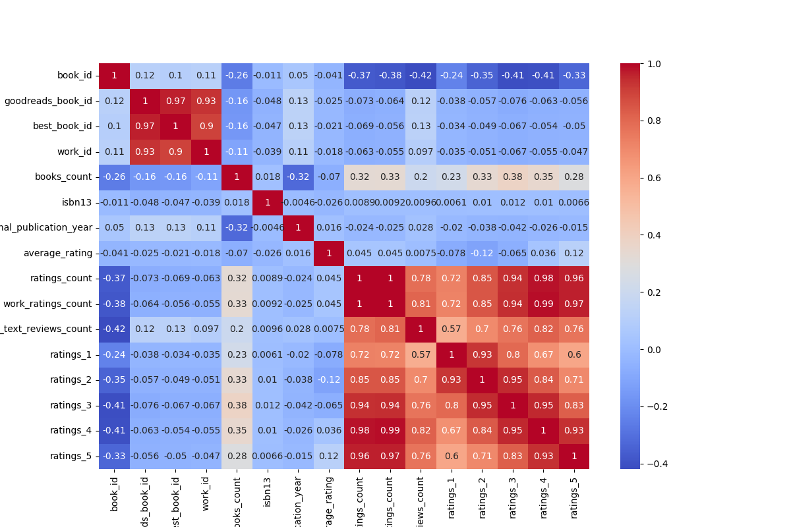

# Data Analysis Report

## Correlation Heatmap


## Analysis Results
**Number of Rows:** 10000  
**Number of Columns:** 23  

### Missing Values:
```json
{
  "book_id": 0,
  "goodreads_book_id": 0,
  "best_book_id": 0,
  "work_id": 0,
  "books_count": 0,
  "isbn": 700,
  "isbn13": 585,
  "authors": 0,
  "original_publication_year": 21,
  "original_title": 585,
  "title": 0,
  "language_code": 1084,
  "average_rating": 0,
  "ratings_count": 0,
  "work_ratings_count": 0,
  "work_text_reviews_count": 0,
  "ratings_1": 0,
  "ratings_2": 0,
  "ratings_3": 0,
  "ratings_4": 0,
  "ratings_5": 0,
  "image_url": 0,
  "small_image_url": 0
}
```

### Column Types:
```json
{
  "book_id": "int64",
  "goodreads_book_id": "int64",
  "best_book_id": "int64",
  "work_id": "int64",
  "books_count": "int64",
  "isbn": "object",
  "isbn13": "float64",
  "authors": "object",
  "original_publication_year": "float64",
  "original_title": "object",
  "title": "object",
  "language_code": "object",
  "average_rating": "float64",
  "ratings_count": "int64",
  "work_ratings_count": "int64",
  "work_text_reviews_count": "int64",
  "ratings_1": "int64",
  "ratings_2": "int64",
  "ratings_3": "int64",
  "ratings_4": "int64",
  "ratings_5": "int64",
  "image_url": "object",
  "small_image_url": "object"
}
```

### Summary Statistics:
```json
{
  "book_id": {
    "count": 10000.0,
    "unique": NaN,
    "top": NaN,
    "freq": NaN,
    "mean": 5000.5,
    "std": 2886.8956799071675,
    "min": 1.0,
    "25%": 2500.75,
    "50%": 5000.5,
    "75%": 7500.25,
    "max": 10000.0
  },
  "goodreads_book_id": {
    "count": 10000.0,
    "unique": NaN,
    "top": NaN,
    "freq": NaN,
    "mean": 5264696.5132,
    "std": 7575461.863589611,
    "min": 1.0,
    "25%": 46275.75,
    "50%": 394965.5,
    "75%": 9382225.25,
    "max": 33288638.0
  },
  "best_book_id": {
    "count": 10000.0,
    "unique": NaN,
    "top": NaN,
    "freq": NaN,
    "mean": 5471213.5801,
    "std": 7827329.890719961,
    "min": 1.0,
    "25%": 47911.75,
    "50%": 425123.5,
    "75%": 9636112.5,
    "max": 35534230.0
  },
  "work_id": {
    "count": 10000.0,
    "unique": NaN,
    "top": NaN,
    "freq": NaN,
    "mean": 8646183.4246,
    "std": 11751060.824080039,
    "min": 87.0,
    "25%": 1008841.0,
    "50%": 2719524.5,
    "75%": 14517748.25,
    "max": 56399597.0
  },
  "books_count": {
    "count": 10000.0,
    "unique": NaN,
    "top": NaN,
    "freq": NaN,
    "mean": 75.7127,
    "std": 170.47072765025834,
    "min": 1.0,
    "25%": 23.0,
    "50%": 40.0,
    "75%": 67.0,
    "max": 3455.0
  },
  "isbn": {
    "count": 9300,
    "unique": 9300,
    "top": "439023483",
    "freq": 1,
    "mean": NaN,
    "std": NaN,
    "min": NaN,
    "25%": NaN,
    "50%": NaN,
    "75%": NaN,
    "max": NaN
  },
  "isbn13": {
    "count": 9415.0,
    "unique": NaN,
    "top": NaN,
    "freq": NaN,
    "mean": 9755044298883.463,
    "std": 442861920665.57336,
    "min": 195170342.0,
    "25%": 9780316192995.0,
    "50%": 9780451528640.0,
    "75%": 9780830777175.0,
    "max": 9790007672390.0
  },
  "authors": {
    "count": 10000,
    "unique": 4664,
    "top": "Stephen King",
    "freq": 60,
    "mean": NaN,
    "std": NaN,
    "min": NaN,
    "25%": NaN,
    "50%": NaN,
    "75%": NaN,
    "max": NaN
  },
  "original_publication_year": {
    "count": 9979.0,
    "unique": NaN,
    "top": NaN,
    "freq": NaN,
    "mean": 1981.987674115643,
    "std": 152.57666516754668,
    "min": -1750.0,
    "25%": 1990.0,
    "50%": 2004.0,
    "75%": 2011.0,
    "max": 2017.0
  },
  "original_title": {
    "count": 9415,
    "unique": 9274,
    "top": " ",
    "freq": 5,
    "mean": NaN,
    "std": NaN,
    "min": NaN,
    "25%": NaN,
    "50%": NaN,
    "75%": NaN,
    "max": NaN
  },
  "title": {
    "count": 10000,
    "unique": 9964,
    "top": "Selected Poems",
    "freq": 4,
    "mean": NaN,
    "std": NaN,
    "min": NaN,
    "25%": NaN,
    "50%": NaN,
    "75%": NaN,
    "max": NaN
  },
  "language_code": {
    "count": 8916,
    "unique": 25,
    "top": "eng",
    "freq": 6341,
    "mean": NaN,
    "std": NaN,
    "min": NaN,
    "25%": NaN,
    "50%": NaN,
    "75%": NaN,
    "max": NaN
  },
  "average_rating": {
    "count": 10000.0,
    "unique": NaN,
    "top": NaN,
    "freq": NaN,
    "mean": 4.002191000000001,
    "std": 0.25442748053872905,
    "min": 2.47,
    "25%": 3.85,
    "50%": 4.02,
    "75%": 4.18,
    "max": 4.82
  },
  "ratings_count": {
    "count": 10000.0,
    "unique": NaN,
    "top": NaN,
    "freq": NaN,
    "mean": 54001.2351,
    "std": 157369.95643554674,
    "min": 2716.0,
    "25%": 13568.75,
    "50%": 21155.5,
    "75%": 41053.5,
    "max": 4780653.0
  },
  "work_ratings_count": {
    "count": 10000.0,
    "unique": NaN,
    "top": NaN,
    "freq": NaN,
    "mean": 59687.3216,
    "std": 167803.7852374182,
    "min": 5510.0,
    "25%": 15438.75,
    "50%": 23832.5,
    "75%": 45915.0,
    "max": 4942365.0
  },
  "work_text_reviews_count": {
    "count": 10000.0,
    "unique": NaN,
    "top": NaN,
    "freq": NaN,
    "mean": 2919.9553,
    "std": 6124.378131569911,
    "min": 3.0,
    "25%": 694.0,
    "50%": 1402.0,
    "75%": 2744.25,
    "max": 155254.0
  },
  "ratings_1": {
    "count": 10000.0,
    "unique": NaN,
    "top": NaN,
    "freq": NaN,
    "mean": 1345.0406,
    "std": 6635.626262783459,
    "min": 11.0,
    "25%": 196.0,
    "50%": 391.0,
    "75%": 885.0,
    "max": 456191.0
  },
  "ratings_2": {
    "count": 10000.0,
    "unique": NaN,
    "top": NaN,
    "freq": NaN,
    "mean": 3110.885,
    "std": 9717.123578396993,
    "min": 30.0,
    "25%": 656.0,
    "50%": 1163.0,
    "75%": 2353.25,
    "max": 436802.0
  },
  "ratings_3": {
    "count": 10000.0,
    "unique": NaN,
    "top": NaN,
    "freq": NaN,
    "mean": 11475.8938,
    "std": 28546.449183182456,
    "min": 323.0,
    "25%": 3112.0,
    "50%": 4894.0,
    "75%": 9287.0,
    "max": 793319.0
  },
  "ratings_4": {
    "count": 10000.0,
    "unique": NaN,
    "top": NaN,
    "freq": NaN,
    "mean": 19965.6966,
    "std": 51447.35838380058,
    "min": 750.0,
    "25%": 5405.75,
    "50%": 8269.5,
    "75%": 16023.5,
    "max": 1481305.0
  },
  "ratings_5": {
    "count": 10000.0,
    "unique": NaN,
    "top": NaN,
    "freq": NaN,
    "mean": 23789.8056,
    "std": 79768.88561077163,
    "min": 754.0,
    "25%": 5334.0,
    "50%": 8836.0,
    "75%": 17304.5,
    "max": 3011543.0
  },
  "image_url": {
    "count": 10000,
    "unique": 6669,
    "top": "https://s.gr-assets.com/assets/nophoto/book/111x148-bcc042a9c91a29c1d680899eff700a03.png",
    "freq": 3332,
    "mean": NaN,
    "std": NaN,
    "min": NaN,
    "25%": NaN,
    "50%": NaN,
    "75%": NaN,
    "max": NaN
  },
  "small_image_url": {
    "count": 10000,
    "unique": 6669,
    "top": "https://s.gr-assets.com/assets/nophoto/book/50x75-a91bf249278a81aabab721ef782c4a74.png",
    "freq": 3332,
    "mean": NaN,
    "std": NaN,
    "min": NaN,
    "25%": NaN,
    "50%": NaN,
    "75%": NaN,
    "max": NaN
  }
}
```

## Summary
Based on the provided dataset metadata, here are several insights:

### Overview
- The dataset contains a total of **10,000 rows** and **23 columns**, indicating a moderate-sized dataset that may be suitable for a variety of analyses in the literary domain, particularly involving books and their ratings.
  
### Missing Values
- Several columns have missing values. The most notable ones are:
  - **`isbn`**: 700 missing values out of 10,000 (7%).
  - **`isbn13`**: 585 missing values (5.85%).
  - **`original_publication_year`**: 21 missing values (0.21%).
  - **`original_title`**: 585 missing values (5.85%).
  - **`language_code`**: 1084 missing values (10.84%), which is the highest percentage.
  
- The columns with complete data are `book_id`, `goodreads_book_id`, `best_book_id`, `authors`, `title`, and all ratings-related columns.

### Data Types
- The dataset consists of integer (`int64`), floating-point (`float64`), and object (string) data types.
- Important numerical columns include ratings and counts, while categorical data appear under the authors and languages.

### Author Data
- There are **4,664 unique authors** represented in this dataset, with **Stephen King** being the most frequent author, contributing to **60 entries**. This indicates that a few authors may dominate the dataset.
  
### Publication Years
- The **`original_publication_year`** has a wide range from **-1750 to 2017** (though the earlier dates may need verification).
- The average publication year is **1981.99**, suggesting the dataset skewed towards more contemporary works, particularly those published in the late 20th century and onwards.

### Ratings and Counts
- **Average rating** across books is about **4.00**, with a standard deviation of **~0.25**, indicating that most books are rated relatively highly.
- There are considerable distinctions in counts of ratings received:
  - The average **ratings_count** is **54,001**, but the max is significantly high at **4,780,653**, showing a very high variability in popularity among books.
  - Distribution across rating scores (1 to 5) shows varied engagement with ratings but generally trends toward higher scores. The averages for these ratings are:
    - 1 star: 1,345
    - 2 stars: 3,111
    - 3 stars: 11,476
    - 4 stars: 19,966
    - 5 stars: 23,790

### Image Data
- There are **6,669 unique image URLs** for both `image_url` and `small_image_url`, indicating a diverse set of covers and visuals associated with the books.
  
### Language Code
- The most frequent language code is **`eng`** (English) with **6,341 occurrences**, reflecting a language bias in the dataset. There are **25 unique language codes** present in total.

### Summary
- This dataset appears to be rich in information regarding books, their authors, publication years, and ratings. The presence of missing values, especially in key areas like ISBN and language codes, could affect certain analyses. The distribution of ratings indicates that most books are well-received. Potential analyses could focus on the correlation between publication year and ratings, popular genres/authors, or comparative studies across different languages.
