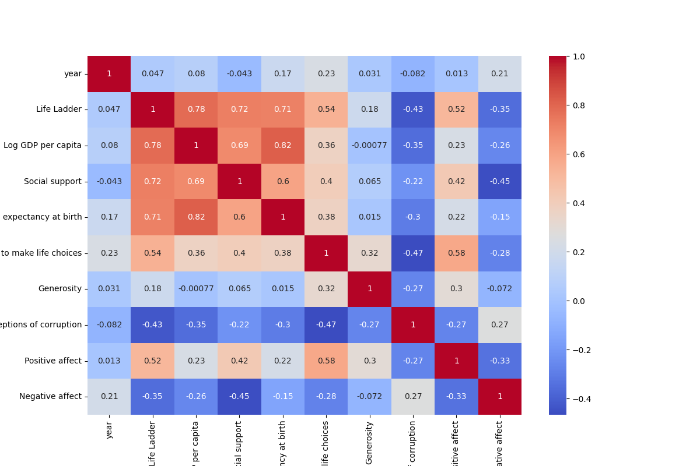

# Data Analysis Report

## Correlation Heatmap


## Analysis Results
**Number of Rows:** 2363  
**Number of Columns:** 11  

### Missing Values:
```json
{
  "Country name": 0,
  "year": 0,
  "Life Ladder": 0,
  "Log GDP per capita": 28,
  "Social support": 13,
  "Healthy life expectancy at birth": 63,
  "Freedom to make life choices": 36,
  "Generosity": 81,
  "Perceptions of corruption": 125,
  "Positive affect": 24,
  "Negative affect": 16
}
```

### Column Types:
```json
{
  "Country name": "object",
  "year": "int64",
  "Life Ladder": "float64",
  "Log GDP per capita": "float64",
  "Social support": "float64",
  "Healthy life expectancy at birth": "float64",
  "Freedom to make life choices": "float64",
  "Generosity": "float64",
  "Perceptions of corruption": "float64",
  "Positive affect": "float64",
  "Negative affect": "float64"
}
```

### Summary Statistics:
```json
{
  "Country name": {
    "count": 2363,
    "unique": 165,
    "top": "Lebanon",
    "freq": 18,
    "mean": NaN,
    "std": NaN,
    "min": NaN,
    "25%": NaN,
    "50%": NaN,
    "75%": NaN,
    "max": NaN
  },
  "year": {
    "count": 2363.0,
    "unique": NaN,
    "top": NaN,
    "freq": NaN,
    "mean": 2014.7638595006347,
    "std": 5.059436468192795,
    "min": 2005.0,
    "25%": 2011.0,
    "50%": 2015.0,
    "75%": 2019.0,
    "max": 2023.0
  },
  "Life Ladder": {
    "count": 2363.0,
    "unique": NaN,
    "top": NaN,
    "freq": NaN,
    "mean": 5.483565806178587,
    "std": 1.1255215132391925,
    "min": 1.281,
    "25%": 4.647,
    "50%": 5.449,
    "75%": 6.3235,
    "max": 8.019
  },
  "Log GDP per capita": {
    "count": 2335.0,
    "unique": NaN,
    "top": NaN,
    "freq": NaN,
    "mean": 9.399671092077089,
    "std": 1.1520694444710216,
    "min": 5.527,
    "25%": 8.506499999999999,
    "50%": 9.503,
    "75%": 10.3925,
    "max": 11.676
  },
  "Social support": {
    "count": 2350.0,
    "unique": NaN,
    "top": NaN,
    "freq": NaN,
    "mean": 0.8093693617021277,
    "std": 0.12121176420299144,
    "min": 0.228,
    "25%": 0.744,
    "50%": 0.8345,
    "75%": 0.904,
    "max": 0.987
  },
  "Healthy life expectancy at birth": {
    "count": 2300.0,
    "unique": NaN,
    "top": NaN,
    "freq": NaN,
    "mean": 63.40182826086957,
    "std": 6.842644351828009,
    "min": 6.72,
    "25%": 59.195,
    "50%": 65.1,
    "75%": 68.5525,
    "max": 74.6
  },
  "Freedom to make life choices": {
    "count": 2327.0,
    "unique": NaN,
    "top": NaN,
    "freq": NaN,
    "mean": 0.750281908036098,
    "std": 0.13935703459253465,
    "min": 0.228,
    "25%": 0.661,
    "50%": 0.771,
    "75%": 0.862,
    "max": 0.985
  },
  "Generosity": {
    "count": 2282.0,
    "unique": NaN,
    "top": NaN,
    "freq": NaN,
    "mean": 9.772129710780206e-05,
    "std": 0.16138760312630687,
    "min": -0.34,
    "25%": -0.112,
    "50%": -0.022,
    "75%": 0.09375,
    "max": 0.7
  },
  "Perceptions of corruption": {
    "count": 2238.0,
    "unique": NaN,
    "top": NaN,
    "freq": NaN,
    "mean": 0.7439709562109026,
    "std": 0.1848654805936834,
    "min": 0.035,
    "25%": 0.687,
    "50%": 0.7985,
    "75%": 0.86775,
    "max": 0.983
  },
  "Positive affect": {
    "count": 2339.0,
    "unique": NaN,
    "top": NaN,
    "freq": NaN,
    "mean": 0.6518820008550662,
    "std": 0.10623970474397627,
    "min": 0.179,
    "25%": 0.572,
    "50%": 0.663,
    "75%": 0.737,
    "max": 0.884
  },
  "Negative affect": {
    "count": 2347.0,
    "unique": NaN,
    "top": NaN,
    "freq": NaN,
    "mean": 0.27315083084789094,
    "std": 0.08713107245795021,
    "min": 0.083,
    "25%": 0.209,
    "50%": 0.262,
    "75%": 0.326,
    "max": 0.705
  }
}
```

## Summary
The provided dataset contains information across 2,363 rows and 11 columns. Here’s a detailed analysis of its metadata, including insights regarding the structure, quality, and content of the dataset:

### General Structure
- **Number of Rows**: 2,363
- **Number of Columns**: 11

### Data Quality
- **Missing Values**: Several columns contain missing values, indicating potential data quality issues:
  - **Log GDP per capita**: 28 missing values
  - **Social support**: 13 missing values
  - **Healthy life expectancy at birth**: 63 missing values
  - **Freedom to make life choices**: 36 missing values
  - **Generosity**: 81 missing values
  - **Perceptions of corruption**: 125 missing values
  - **Positive affect**: 24 missing values
  - **Negative affect**: 16 missing values
  
  The column `Generosity` has the highest number of missing values (81), which could indicate low response rates or difficulties in quantifying generosity in certain regions.

### Column Types and Summary Statistics
- **Column Data Types**:
  - The dataset contains both numerical (int64, float64) and categorical (object) types. 
  - Most columns are numeric and represent various socio-economic indicators.

- **Key Statistics**:
  - **Year**: The dataset spans from 2005 to 2023, with a mean year of approximately 2015.
  - **Life Ladder**: Indicates subjective well-being with a mean value of about 5.48, suggesting a moderate level of life satisfaction across countries. The values range from 1.281 to 8.019.
  - **Log GDP per capita**: Represents economic performance with a mean log GDP of approximately 9.40, suggesting that most countries included in the dataset have a moderate to high economic standing.
  - **Social Support**: Mean value of about 0.81 indicates relatively high perceived social support.
  - **Healthy Life Expectancy at Birth**: With a mean of about 63.40 years, this statistic indicates the general health conditions and longevity in various countries.
  - **Freedom to Make Life Choices**: The mean score of around 0.75 reflects a relatively high degree of personal freedom experienced by individuals in the participating countries.
  - **Generosity**: The mean is very close to zero (9.77e-05), suggesting that respondents may feel generally less generous, or the measure reflects a low occurrence of generosity.
  - **Perceptions of Corruption**: A mean value of approximately 0.74, indicating a generally high perception of corruption in the surveyed countries.
  - **Positive Affect**: A mean value of about 0.65 indicates moderate levels of positivity among respondents.
  - **Negative Affect**: The mean is around 0.27, suggesting that while some negative feelings are present, they are lower relative to positive feelings.

### Insights
1. **Well-Being Indicators**: The dataset captures various well-being indicators, revealing a complex interplay between financial, social, and health metrics. The moderate scores in Life Ladder and high GDP per capita suggest that economic factors may positively influence individual life satisfaction, but other factors such as social support are also vital.

2. **Diversity of Countries**: With 165 unique country names and the most frequent country being Lebanon (18 occurrences), the dataset appears to cover a diversity of nations, although the uneven distribution in the number of occurrences could indicate some countries are over-represented.

3. **Data Completeness Issues**: The significant number of missing values in some columns warrants attention, especially in Generosity and Perceptions of Corruption. These gaps could limit analysis and interpretation, particularly for comparative studies or where these attributes are crucial.

4. **Potential Bibliographies for Analysis**: The dataset could be particularly useful for researchers exploring the relationships between economic conditions (e.g., GDP) and happiness or life satisfaction. The correlations between social support and life satisfaction could further warrant exploration.

5. **Future Recommendations**: To enhance the dataset’s usability:
   - Consider imputation strategies for missing values, particularly for key variables that might have predictive power.
   - Conduct further analysis to compare trends over years to understand changes in perceptions, well-being, and economic factors.
   - Exploring relationships between different variables could uncover underlying factors influencing life satisfaction across countries. 

### Summary
Overall, the dataset provides a rich resource for analyzing the connections between socio-economic factors and subjective well-being, while also highlighting the need for addressing missing data to yield more reliable insights.
