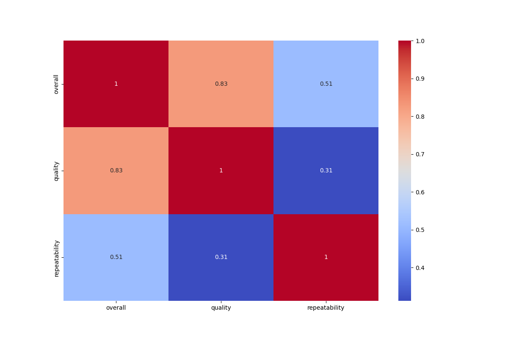

# Data Analysis Report

## Correlation Heatmap


## Analysis Results
**Number of Rows:** 2652  
**Number of Columns:** 8  

### Missing Values:
```json
{
  "date": 99,
  "language": 0,
  "type": 0,
  "title": 0,
  "by": 262,
  "overall": 0,
  "quality": 0,
  "repeatability": 0
}
```

### Column Types:
```json
{
  "date": "object",
  "language": "object",
  "type": "object",
  "title": "object",
  "by": "object",
  "overall": "int64",
  "quality": "int64",
  "repeatability": "int64"
}
```

### Summary Statistics:
```json
{
  "date": {
    "count": 2553,
    "unique": 2055,
    "top": "21-May-06",
    "freq": 8,
    "mean": NaN,
    "std": NaN,
    "min": NaN,
    "25%": NaN,
    "50%": NaN,
    "75%": NaN,
    "max": NaN
  },
  "language": {
    "count": 2652,
    "unique": 11,
    "top": "English",
    "freq": 1306,
    "mean": NaN,
    "std": NaN,
    "min": NaN,
    "25%": NaN,
    "50%": NaN,
    "75%": NaN,
    "max": NaN
  },
  "type": {
    "count": 2652,
    "unique": 8,
    "top": "movie",
    "freq": 2211,
    "mean": NaN,
    "std": NaN,
    "min": NaN,
    "25%": NaN,
    "50%": NaN,
    "75%": NaN,
    "max": NaN
  },
  "title": {
    "count": 2652,
    "unique": 2312,
    "top": "Kanda Naal Mudhal",
    "freq": 9,
    "mean": NaN,
    "std": NaN,
    "min": NaN,
    "25%": NaN,
    "50%": NaN,
    "75%": NaN,
    "max": NaN
  },
  "by": {
    "count": 2390,
    "unique": 1528,
    "top": "Kiefer Sutherland",
    "freq": 48,
    "mean": NaN,
    "std": NaN,
    "min": NaN,
    "25%": NaN,
    "50%": NaN,
    "75%": NaN,
    "max": NaN
  },
  "overall": {
    "count": 2652.0,
    "unique": NaN,
    "top": NaN,
    "freq": NaN,
    "mean": 3.0475113122171944,
    "std": 0.7621797580962717,
    "min": 1.0,
    "25%": 3.0,
    "50%": 3.0,
    "75%": 3.0,
    "max": 5.0
  },
  "quality": {
    "count": 2652.0,
    "unique": NaN,
    "top": NaN,
    "freq": NaN,
    "mean": 3.2092760180995477,
    "std": 0.7967426636666686,
    "min": 1.0,
    "25%": 3.0,
    "50%": 3.0,
    "75%": 4.0,
    "max": 5.0
  },
  "repeatability": {
    "count": 2652.0,
    "unique": NaN,
    "top": NaN,
    "freq": NaN,
    "mean": 1.4947209653092006,
    "std": 0.598289430580212,
    "min": 1.0,
    "25%": 1.0,
    "50%": 1.0,
    "75%": 2.0,
    "max": 3.0
  }
}
```

## Summary
Based on the provided dataset metadata, here are the insights and observations:

### General Overview
- **Total Rows**: The dataset contains 2,652 entries (or rows) and 8 attributes (or columns).
- **Missing Values**: There are some missing values in critical columns:
  - `date`: 99 missing values (approximately 3.7%).
  - `by`: 262 missing values (approximately 9.87%).
- Other columns (`language`, `type`, `title`, `overall`, `quality`, `repeatability`) have no missing values.

### Column Data Types
- **Object Types**: 
  - `date`, `language`, `type`, `title`, `by` are of type `object`, indicating they consist of string values.
- **Integer Types**: 
  - `overall`, `quality`, and `repeatability` are of type `int64`, signifying they contain integer data.

### Key Statistical Insights
1. **Date**:
   - Count of non-missing values: 2,553.
   - Unique dates: 2,055, suggesting a significant variation in entries made on different dates. 
   - The most common date is "21-May-06" with a frequency of 8 occurrences.

2. **Language**:
   - There are 11 unique languages, with English being the most represented (1,306 entries).
   - The distribution indicates a diversity of languages present.

3. **Type**:
   - 8 unique types of entries exist, with the predominant type being "movie" (2,211 occurrences). This indicates that the dataset is heavily weighted towards movie-related entries.

4. **Title**:
   - There are 2,312 unique titles, with "Kanda Naal Mudhal" being the most frequently occurring title (9 times). This suggests a commonality or popularity around this particular title within the dataset.

5. **Contributors (`by`)**:
   - There are 1,528 unique contributors with a primary contributor being "Kiefer Sutherland" (48 occurrences).
   - The significant number of missing values points to much data being contributed by a wide variety of individuals, with many contributing only once.

6. **Overall Ratings**:
   - The `overall` rating statistics show a mean of approximately 3.05 with a standard deviation of about 0.76. This suggests that the ratings are somewhat clustered around the middle but with enough variation to note different perspectives.
   - Ratings range from 1 to 5, with a median at 3.

7. **Quality Ratings**:
   - The mean quality rating is about 3.21, slightly higher than overall ratings which indicates that while the overall experience has some lower ratings, perceived quality has a more favorable score.
   - The data also ranges from 1 to 5, indicating a similar distribution pattern as the overall ratings.

8. **Repeatability Ratings**:
   - The repeatability has a mean close to 1.49 with a maximum of 3. This may indicate that most entries are rated as low in repeatability, meaning they are less likely to be revisited or viewed repeatedly.

### Conclusion
The dataset provides diverse entries with rich metadata regarding films, languages, contributions, and ratings. The presence of missing values in critical columns like `date` and `by` may affect analysis accuracy, especially regarding trends over time or contributor insights. Given the predominance of English movies and the apparent popularity of certain titles and contributors, further analysis could focus on trends in ratings by language, yearly trends, or the impact of specific contributors on the ratings.

### Recommendations
- **Data Cleaning**: Consider handling missing values for better insights, possibly through imputation or analysis of impacted records.
- **Further Analysis**: Investigate contributors' influence on overall ratings and explore correlations between the repeatability and quality ratings to understand user engagement.
- **Time Series Analysis**: Explore date distributions to identify trends over time and how they might relate to peaks or troughs in ratings or contributors.

